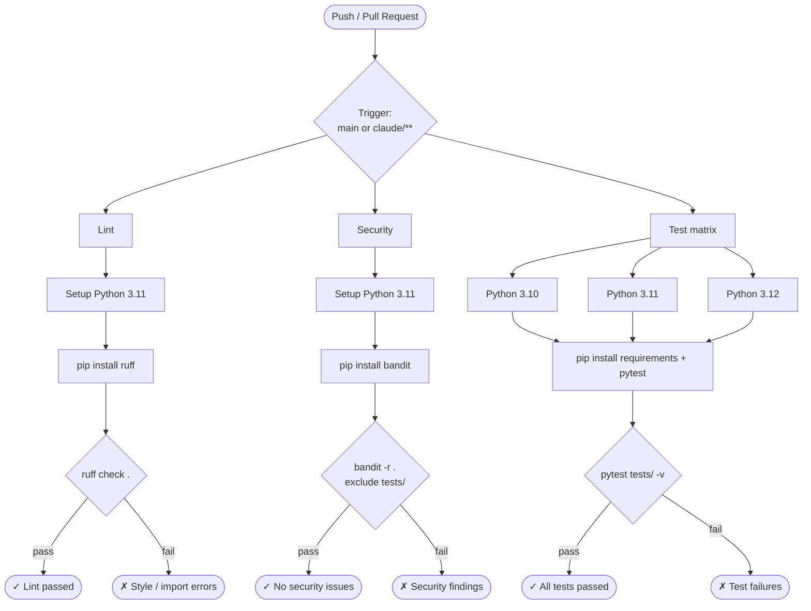

# AbuseIPDB

A Python script that fetches IP blacklist data from the [AbuseIPDB API](https://docs.abuseipdb.com/) and exports it as a deduplicated CSV.

## What it does

- Queries the AbuseIPDB blacklist endpoint filtered by confidence score, age, and country
- Normalizes the JSON response with pandas
- Outputs a deduplicated CSV (`apdb.csv`) with IP address, country code, abuse confidence score, and last reported date

## Requirements

- Python 3.10+
- Dependencies listed in `requirements.txt`

```bash
pip install -r requirements.txt
```

## Configuration

Before running, open `abipdbIOCS.py` and update:

| Variable | Description |
|---|---|
| `headers['Key']` | Your AbuseIPDB API key |
| `querystring['confidenceMinimum']` | Minimum abuse confidence score (0–100) |
| `querystring['maxAgeInDays']` | How far back to look for reports |
| `querystring['onlyCountries']` | Comma-separated country codes to filter |

## Usage

```bash
python abipdbIOCS.py
```

Output is written to `apdb.csv` in the current directory.

## CI/CD

This repo uses GitHub Actions with three jobs that run on every push and pull request:

| Job | Tool | Purpose |
|---|---|---|
| Lint | `ruff` | Enforce code style and catch errors |
| Security | `bandit` | Scan for common security issues |
| Test | `pytest` | Run smoke tests across Python 3.10, 3.11, 3.12 |

### Pipeline diagram



### Running locally

```bash
pip install ruff bandit pytest
ruff check .
bandit -r . --exclude ./.git
pytest tests/ -v
```
